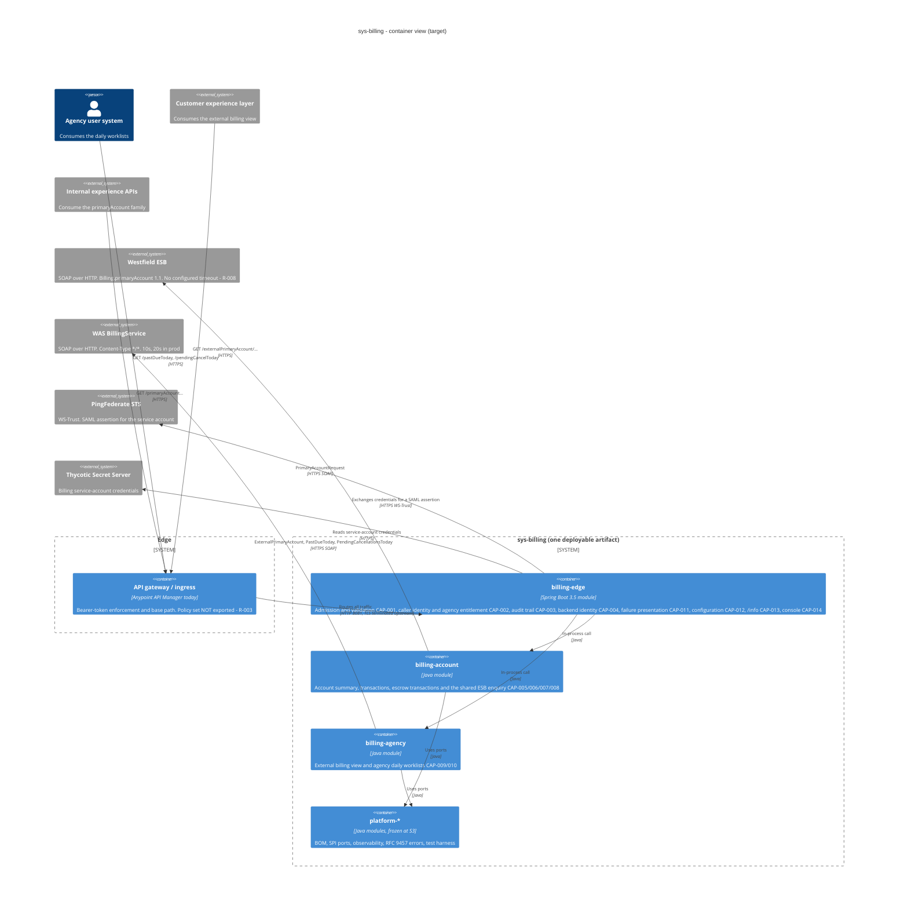

# ADR-0001: Service decomposition — one deployable, three owned modules, five platform modules

Status:   Accepted (pending human approval at the S3 gate)
Date:     2026-08-14
Deciders: migration-architect, [human approver]
Supersedes: —
Candidate: `out/adr-candidates/ADR-CANDIDATE-0001-service-decomposition.md`

## Context

`sapi-billing` is one Mule application publishing eight read-only `GET` endpoints under one base
path, over two SOAP back ends. It owns **no data**: no database, no queue, no scheduler, no cache,
no transaction anywhere (km §3, §9). Fourteen capabilities were identified at S2.

The seams the knowledge map can actually evidence:

- **Backend ownership.** CAP-005/006/007 reach the Westfield ESB through one shared enquiry
  (CAP-008, `km:node/N-0079`). CAP-009/010 reach the WAS `BillingService`. The two groups share no
  response shape and no business data.
- **Change rate.** The ESB contract is versioned and hardcoded (`Billing.primaryAccount` 1.1,
  N-0081); the WAS contract has no WSDL at all (U8, R-017). Different clocks.
- **Blast radius.** The agency worklists are unbounded and unpaged and are named by the map as the
  most likely timeout candidate in the application (N-0060 ec, R-010).
- **Cross-cutting, owning nothing.** CAP-001 (admission), CAP-002 (caller identity), CAP-003
  (audit), CAP-004 (backend identity), CAP-011 (failure presentation), CAP-012 (config),
  CAP-013 (`/info`), CAP-014 (console).

Two facts constrain deployment-level splitting. The **externally visible base path is unknown**
(U12, R-002) and the **deployment model is unknown** (U14, R-015). Independently deployable services
would require an ingress capable of path-prefix routing that nobody in this migration has confirmed
exists, and would make `/info` — one published endpoint reporting *the* build — ambiguous across two
artifacts.

The honest test from the architect's definition — *can one team own this end to end, and does it own
its data?* — answers "yes, and there is no data". That test does not license a split. But a single
undifferentiated module fails a different requirement: it gives the S4 fleet one packet with 56
tasks and 124 estimated days, and it leaves the two backend adapters, the audit obligation and the
token exchange free to entangle exactly as they did in Mule.

## Decision

**One deployable artifact, `sys-billing`, composed of three separately owned Maven modules over five
frozen platform modules.**

| Module | Capabilities | Owner at S4 | Endpoints |
|---|---|---|---|
| `services/billing-edge` | CAP-001, 002, 003, 004, 011, 012, 013, 014 | packet `WP-001` | `/info`, `/console/*` |
| `services/billing-account` | CAP-005, 006, 007, 008 | packet `WP-002` | `/primaryAccount`, `/primaryAccount/transactions`, `/primaryAccount/policy/escrow/transactions` |
| `services/billing-agency` | CAP-009, 010 | packet `WP-003` | `/externalPrimaryAccount/{billingAccountNumber}/account-billing`, `/externalPrimaryAccount/{policyNumber}/policy-billing`, `/pastDueToday/{agencyCode}`, `/pendingCancelToday/{agencyCode}` |

Module dependency direction is acyclic: `billing-account` and `billing-agency` depend only on
`platform/*`; `billing-edge` depends on `platform/*` **and** on both feature modules, because it is
the assembly (Spring Boot main class, `application.yaml`, the admission funnel, the audit funnel).
No feature module depends on another feature module.

`platform-bom`, `platform-spi`, `platform-observability`, `platform-errors` and `platform-testing`
are written at S3 and are **read-only at S4**. `platform-spi` carries the ports the three modules
coordinate through (`BackendAssertionProvider`, `CallerContext`, `AuditRecordPort`,
`BillingFaultClassifier`, `LegacyBehaviourFlags`); their signatures are part of the S3 contract, and
a module needing one changed raises a contract defect to the architect rather than editing it.

Each module keeps hexagonal layering (`domain` / `application` / `adapter/in` / `adapter/out`),
enforced by ArchUnit in `platform-testing`. `domain` holds the rules extracted from DataWeave and
imports neither Spring nor JAXB.

No module has an `asyncapi.yaml`. Per ADR-0002 there is nothing asynchronous to describe;
`contracts/README.md` records that absence so it reads as a decision rather than an omission.

## C4 — container view

## Rejected alternatives

**A — one undifferentiated service (single module).** Rejected: it reproduces the Mule
application's internal shape as well as its deployment shape. The two backend adapters, the audit
obligation and the token exchange would sit in one package graph with nothing but convention holding
them apart — and convention is what produced five copies of the endpoint logger, three copies of the
duplicate-key parse and four copies of the fault test in the source we are replacing. It also
collapses the S4 fleet to a single writer with 56 tasks, removing the parallelism the pipeline
exists to provide.

**B — two or three independently deployable services split on backend.** Rejected *for now*, and
the reasons are contingent rather than principled — which is exactly why the module boundaries are
drawn where the service boundaries would go. The published base path is unknown (R-002), the
deployment model is unknown (R-015), `/info` would become ambiguous across artifacts, and four
cross-cutting capabilities would have to be duplicated or extracted for two consumers. Splitting
buys independent deployability that nothing in the knowledge map asks for, at the price of a new
ingress dependency during a cutover whose infrastructure we cannot see.

**C — one service per capability (14).** Rejected on sight, recorded so it is not re-derived: eight
read-only GETs with no data of their own do not become fourteen network hops.

## Consequences

+ Three disjoint write scopes at S4. No file has two writers, so there is nothing to merge.
+ The ESB and WAS adapters cannot accidentally share code: different modules, different owners, and
  per ADR-0006 deliberately different null conventions.
+ Cutover is one artifact swap and one ingress change, exactly as today.
+ Promotion to separate deployables later is a `pom.xml` change plus an ingress rule.
− This is a **modular monolith**. `services/<name>/` in this repository does **not** mean
  "independently deployable service", which is what the scaffold layout normally implies. Anyone
  reading the tree without reading this ADR will get that wrong; `MULESHIFT.md` says so in its first
  paragraph, and that is a documentation mitigation, which is the weakest kind.
− `billing-edge` is the largest packet (24 tasks, ~49 days) and is on the critical path for the
  other two because it owns the SPI implementations they call. Dispatch order compensates; schedule
  risk does not disappear.
− The three modules share one JVM and one thread pool. The unbounded worklist (R-010) can still
  exhaust it and take the account endpoints down with it. A separate inbound executor for
  `billing-agency` (ADR-0014) is the only bulkhead available inside one deployable, and it is
  weaker than process isolation would be.

## Verification

- ArchUnit in `platform-testing`: no class under `billing-account` may depend on `billing-agency` or
  vice versa; neither may depend on `billing-edge`.
- ArchUnit: `..domain..` depends on no Spring, no JAXB and no `..adapter..` type.
- CI scope check: files changed in a packet's PR are a subset of that packet's `allowed_paths`.
- Every task in `out/tasks/` carries `service` equal to one of the three module names and appears in
  exactly one work packet.

## Traces to

`km:node/N-0079, N-0053, N-0058, N-0063, N-0085, N-0088, N-0095, N-0060` ·
`spec:capability/CAP-001 … CAP-014` · `risk:R-002, R-010, R-015`
