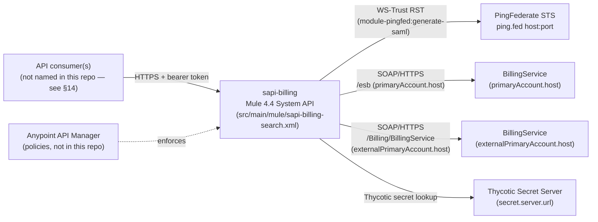
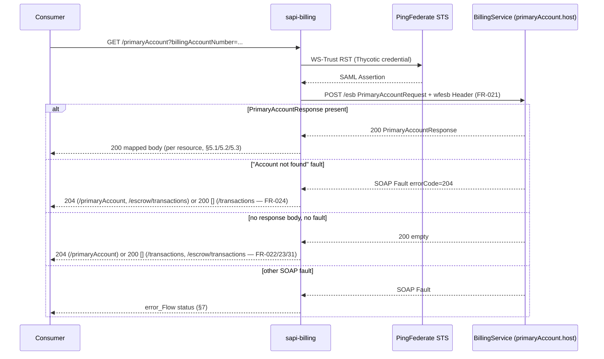
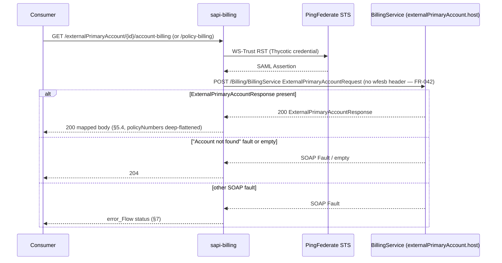
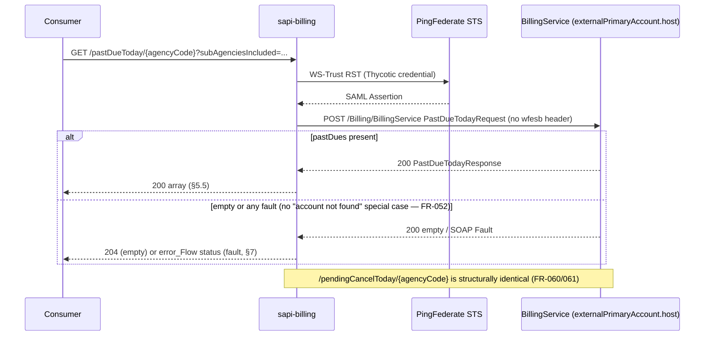

This document specifies, exhaustively, what `sapi-billing` (a MuleSoft 4.4 System API) does today,
so that a separate team can rebuild it as a Java Spring Boot service without opening the Mule
repository. It is written for that rewrite team: a principal engineer scoping the work, an
integration architect verifying every downstream contract is captured, and a test architect
seeding the new test suite. If a fact about current behavior is not written down here, treat it as
lost — go back to `archive/sapi-billing/` rather than guessing.

`sapi-billing` (RAML title: "sapi-billing", `src/main/resources/api/sapi-billing-search.raml:2-4`)
is a System API that fronts a single downstream SOAP service, `BillingService`, exposing eight
JSON/HTTPS resources that resolve billing, past-due, pending-cancellation and escrow information
for insurance policies and accounts. It also fronts a second billing-adjacent SOAP contract at a
different host for two "externalPrimaryAccount" resources. Every resource requires a bearer token
and, in turn, the API itself must obtain a SAML assertion from a PingFederate STS before it can
call BillingService.

## 1. Overview

`sapi-billing` is called by internal Westfield consumers needing billing data for a policy or
agency (the RAML documents no specific consumer by name — see §14). For every inbound request it:

1. Validates the caller's bearer token (Mule API-led security; enforced by API Manager policy, not
   visible in this repo — see §8).
2. Obtains a SAML 2.0 assertion from a PingFederate STS using a service credential (Thycotic
   Secret Server-backed).
3. Builds a SOAP request, signs it with the SAML assertion, and calls the downstream
   `BillingService` SOAP endpoint (one of two hosts, depending on resource — see §6).
4. Maps the SOAP XML response to JSON and returns it, or maps a SOAP fault / empty result to an
   HTTP status.

Every step above is structural to every one of the eight resources; the differences between
resources are the outbound SOAP body shape, the response mapping, and what "no result" means for
that resource (204 vs. 200-with-empty-body — see §7 and §4).

## 2. System Context

Figure 1 shows the full set of external actors: one inbound edge (the consumer, authenticated by an
API Manager policy this repo doesn't contain) and three outbound edges (two BillingService hosts,
PingFederate, and — one level removed, via the STS credential — Thycotic). `sapi-billing` talks to
**two different hostnames for the same conceptual `BillingService`**: the
primaryAccount / transactions / escrow-transactions resources call `primaryAccount.host` + path
`primaryAccount.path` (`/esb`); the externalPrimaryAccount / pastDueToday / pendingCancelToday
resources call the shared `HTTP_Request_configuration`, whose host is `externalPrimaryAccount.host`
and whose path is the literal `/Billing/BillingService`
(`src/main/mule/global.xml:21-23`, `src/main/mule/implementation/primaryAccount-implementation.xml:9-11`).
No property or comment in the repo explains why the same backend is reached two different ways —
flagged in §14.

## 3. API Contract

Base RAML: `src/main/resources/api/sapi-billing-search.raml`. All resources are `HTTPS` only
(`sapi-billing-search.raml:6-7`), version `v1`. Every resource applies the `secured` trait
(`sapi-billing-search.raml:16`, defined in `commontraits/1.0.7/secured_bearer.raml:1-8`): header
`Authorization: bearer <token>`, required. Six of the eight also apply `commonErrors`
(`commonerrorresponses/1.0.5/commonerrorresponses.raml`) — standard 400/401/403/404/405/406/415/
500/597/598/599 responses, body `commonError.raml` for the generic ones (§7 has the flow-specific
mapping actually implemented, which is narrower than what the trait documents as *possible*).

| # | Method & Path | Query / Path Params | Security traits | 200 body | Empty-result status | Backing flow |
|---|---|---|---|---|---|---|
| 1 | `GET /info` | — | `secured` | `{buildNumber, buildName, gitCommitHash, otherBuildInfo, currentTimeStamp}` | n/a | `get:\info` (`sapi-billing-search.xml:251-270`) |
| 2 | `GET /primaryAccount` | Query: `billingAccountNumber` (string, len 10, RAML-documented required; `policyNumber`, `policyVersion` accepted by the flow but **not documented** in this resource's RAML — see §14) | `commonErrors`, `secured` | `primaryAccount` type (`dataTypes/primaryAccount.raml`) | **204 No Content** | `get:\primaryAccount` → `primaryAccount-implementation` (`sapi-billing-search.xml:271-273`, `primaryAccount-implementation.xml:207-228`) |
| 3 | `GET /primaryAccount/transactions` | Query: `billingAccountNumber` (len 10, required); `policyNumber`/`policyVersion` accepted, undocumented | `commonErrors`, `secured` | JSON array of transaction objects | **200 with `[]`** | `get:\primaryAccount\transactions` → `transactions-implementation` (`sapi-billing-search.xml:274-276`, `primaryAccountTransactions-implementation.xml:8-56`) |
| 4 | `GET /primaryAccount/policy/escrow/transactions` | Query: `policyNumber` (len 7, required), `billingAccountNumber` (len 10, required), `policyVersion?` (optional) | `commonErrors`, `secured` | `{policyNumber, policyVersion, escrowTransactions:[]}` | **204** on fault; **200 with a bare `[]`** on "no PrimaryAccountResponse" (shape mismatch — see §14) | `get:\primaryAccount\policy\escrow\transactions` → `escrowTransactions-implementation` (`sapi-billing-search.xml:277-279`, `escrowTransactions-implementation.xml:7-32`) |
| 5 | `GET /externalPrimaryAccount/{billingAccountNumber}/account-billing` | Path: `billingAccountNumber` (len 10) | `commonErrors`, `secured`, `environment` | `myLib.externalPrimaryAccount` (`library.raml:4-10`) | **204** | `get:\externalPrimaryAccount\(billingAccountNumber)\account-billing` → `AccountDetailsFlow` (`sapi-billing-search.xml:143-163`, `implementation.xml:11-88`) |
| 6 | `GET /externalPrimaryAccount/{policyNumber}/policy-billing` | Path: `policyNumber` (len 7) | `commonErrors`, `secured`, `environment` | same as #5 | **204** | `get:\externalPrimaryAccount\(policyNumber)\policy-billing` → `AccountDetailsFlow` (`sapi-billing-search.xml:164-184`) |
| 7 | `GET /pastDueToday/{agencyCode}` | Path: `agencyCode` (len 1-7); Query: `subAgenciesIncluded` (string, optional) | `commonErrors`, `secured`, `environment` | JSON array of past-due entries (`myLib.pastDueToday`) | **204** | `get:\pastDueToday\(agencyCode)` → `get-past-due-today-flow` (`sapi-billing-search.xml:185-217`, `implementation.xml:89-168`) |
| 8 | `GET /pendingCancelToday/{agencyCode}` | Path: `agencyCode` (len 1-7); Query: `subAgenciesIncluded` (string, optional) | `commonErrors`, `secured`, `environment` | JSON array of pending-cancellation entries (`myLib.pendingCancelToday`) | **204** | `get:\pendingCancelToday\(agencyCode)` → `get-pending-cancellation-today-flow` (`sapi-billing-search.xml:218-250`, `implementation.xml:169-247`) |

The `environment` trait (`commontraits/1.0.7/environmentQP.raml:1-7`) documents a required query
parameter `environment` (enum `DEV, QA, QAN, SIT, STAGE, PERF, PROD`) on resources 5–8. **No flow
reads this parameter** (`vars.params`/`attributes.uriParams` usage in `implementation.xml` never
references `environment`) — it is applied in the RAML contract but appears unused by the
implementation. Flagged in §14; do not silently drop it from the rewrite's contract without
confirming with the API's owner, since a consumer may already be sending it.

Traits available via the shared `commontraits/1.0.7` Exchange module but **not applied to any
resource in this API** — `cacheable-trait`, `content-cacheable-trait`, `time-cacheable-trait`,
`countable-trait`, `pageable-trait`, `partial-trait`, `sortable-trait`, `noResponseCache`. Listed
for completeness (per the "no sampling" rule) — they carry no requirement here.

### 3.1 Response schemas (flattened)

**`primaryAccount` type** (`dataTypes/primaryAccount.raml:1-71`, example `api/Example/primaryAccount.json`):

| Field | Type | Notes |
|---|---|---|
| `accountBalance` | number | |
| `accountNumber` | string, len 10 | |
| `billTocontact.name` | string | |
| `billTocontact.address.{street,city,state,zip}` | string | RAML names it `street`; source XML field is `addressLine1` (§5.1) |
| `billingSystemCode` | string | e.g. `DuckCreek`, `BCMS` |
| `billType` | string, len 1-5 | |
| `dueAmount`, `lastPaymentAmount`, `pastDueAmount` | number | |
| `dueDate`, `dateBilled`, `lastPaymentDate`, `pastDueDate` | string, `yyyy-mm-dd` | |
| `eft` | **RAML says `boolean`** | MUnit fixtures assert the JSON string `"false"`, not the boolean `false` — see §14 |
| `policies[]` | array of `{policyNumber, hasEscrow: boolean, billingStatus: string}` | `billingStatus` is present in one MUnit fixture and absent in another for the same field — see §14 |

**Transactions array item** (`dataTypes/transaction.raml:1-15`, example `api/Example/primaryAccountTransactions.json`): `{description: string, amountDue: number, dueDate: string (yyyy-mm-dd), processingDate: string (yyyy-mm-dd)}`.

**Escrow transactions response** (`api/Example/escrowTransactions.json`): `{policyNumber: string, policyVersion: string, escrowTransactions: Transaction[]}`. `policyNumber` in this response is populated from the BillingService **account number**, not the policy's own number — see §5.3 and the confirming MUnit assertion in §12.

**`externalPrimaryAccount` type** (`library.raml:4-10`, example `billing-objects/1.0.7/examples/externalPrimaryAccountEx.raml`): `{responseHeader.status, accountBalance, accountNumber, billingSystemCode, billTocontact:{aliasName, name, addressLine1, addressLine2, city, state, zip}, commercialAccountIndicator: boolean, currnetAmountDue [sic — typo in the source example], currentAmountDueDate, largeAccountIndicator: boolean, lastPaymentReceivedDate, legacyAccountNumber, legacyBillingSystemCode, pastDueAmount, pastDueDate, policyNumbers: string[], restrictedAccountIndicator: boolean}`. The DataWeave that actually produces this (§5.4) does not use most of these fields — it passes through whatever `ExternalPrimaryAccountResponse` fields BillingService returns, minus `policyNumbers`, which it recomputes; treat the example as illustrative, not authoritative, and the DataWeave rule in §5.4 as ground truth.

**pastDueToday / pendingCancelToday item** (`billing-objects/1.0.7/examples/pastDueToday.raml`, `pendingCancelToday.raml`): `{policyNumber, namedInsured:{name, addressLine1, addressLine2, city, state, zip}, overDueAmount, dueDate|cancelDate}`. Despite `library.raml` typing both as a single `object`, the flows return a **JSON array** of these (§5.5, §5.6) — the RAML type declaration under-documents the actual response envelope.

**Error bodies** (`commonerrorresponses/1.0.5/dataTypes/`): `401-Error.raml` → `{error:{error, error_description}}`; `403-Error.raml` → `{error: string}`; `commonError.raml` (404/405/406/415/500) → `{faultActor, faultCode, faultMessage, faultDetail, faultTime, innerFault:{faultCode:{parentErrorType:{...nested...}}, faultMessage, faultDetail}}`. **What the flows actually emit is narrower** — see §7's table; the trait documents more status codes/shapes than any flow in this repo constructs.

## 4. Functional Requirements

Grouped by flow. Every router branch and validation found in Phase 3 is a numbered requirement.

### FR — Global (`global.xml`, `responseLogFlow.xml`, applies to every resource)

- **FR-001**: Every inbound request is logged on entry with a structured JSON record built by
  `setRequestResponse` (`responseLogFlow.xml:23-24`): `entryTimestamp`, `identifier`
  (`"UWSAPI-REQRES"`), `api` (`{api.name}-{api.version}`), `xApiKey` (header `x-api-key`, else
  `"EMPTY"`), `correlationId`, `interactionCorrelationId` (header `x-interaction-correlation-id`),
  `requestMethod`, `requestTemplate` (request path with path-segment values masked — FR-002),
  `requestUri`, `sub`/`subEmail`/`impersonated`/`act`/`actEmail`/`clientId` from the validated
  token's claims, `entryTimeMillis`, `agencyCode` (claim `agencyCodes`, else `[]`).
- **FR-002**: Path masking (`dwl/reqresImpersonateFun.dwl:8-10`) replaces any path segment that is
  **not** alphabetic (after stripping `-`) with `X` before logging — i.e., numeric IDs (account
  numbers, agency codes) are masked in the logged `requestTemplate`, but the segment count and
  non-numeric segments are preserved.
- **FR-003**: Impersonation detection (`dwl/reqresImpersonateFun.dwl:13-24`): a request is
  "impersonated" if the token's `act` claim is present either as `act.sub` (object form) or
  `actSub` (flat form, and not the literal string `"null"`). `buildactsub`/`buildactEmail` prefer
  the object form (`act.sub`/`act.email`) and fall back to the flat form
  (`actSub`/`actEmail`), defaulting to `'EMPTY'` if neither is present. Ping represents the
  impersonation claim differently depending on the calling application (myWF vs. AWP, per the
  inline comment at `dwl/reqresImpersonateFun.dwl:12`) — this dual-shape handling exists
  specifically to cover both.
- **FR-004**: On exit, `responseLogFlow` (`responseLogFlow.xml:8-21`) logs a second structured
  record merging the entry record with `responseStatusCode` (`vars.httpStatus`), `exitTimeMillis`,
  and `entryExitElapsed` (exit − entry, milliseconds).
- **FR-005**: The HTTP response always echoes an `x-correlation-id` header equal to Mule's
  correlation ID (`sapi-billing-search.xml:6-10`, `18-19`), on both success and error responses.
- **FR-006**: `sapi-billing-search-console` (`sapi-billing-search.xml:117-142`) exposes the
  APIkit console at `/console/*`; it has no Spring Boot equivalent and is dropped in the rewrite
  (springdoc/OpenAPI UI serves the equivalent purpose, not a 1:1 port).

### FR — `/info` (`sapi-billing-search.xml:251-270`)

- **FR-010**: Returns `200` always, body `{buildNumber: p('buildNumber') default '0', buildName:
  p('buildName') default '--', gitCommitHash: p('gitCommitHash') default '--', otherBuildInfo:
  p('otherBuildInfo') default '--', currentTimeStamp: now()}`. Values come from
  `buildInfo.properties` (`src/main/resources/buildInfo.properties:1-4`), Maven-filtered at build
  time from CI-injected values (`Mule_Trigger_Build.yml:26`) — see §6.4.
- **FR-011**: Despite the `secured` trait requiring a bearer token (`sapi-billing-search.raml:16-18`),
  the flow performs no token-derived logic — it is documentation-secured only. FR-011 exists to
  flag that a Spring Security filter must still require the token for parity even though the
  handler ignores its contents.

Figure 2 covers all three resources in this group — they share one downstream call and differ only
in the response mapping and in what "empty" returns as (the diagram's `alt` branches spell out
that difference per resource).

### FR — `/primaryAccount` and `/primaryAccount/transactions` (shared `callBillingService-primaryAccount`)

- **FR-020**: Both resources read `billingAccountNumber`, `policyNumber` (default `null`),
  `policyVersion` (default `null`) from query parameters
  (`primaryAccount-implementation.xml:117-121`), obtain a SAML assertion (FR-070), and POST a
  `PrimaryAccountRequest` SOAP body to `primaryAccount.host` + `primaryAccount.path`
  (`primaryAccount-implementation.xml:169`).
- **FR-021**: The outbound SOAP envelope for this call — and **only** this call, among all eight
  resources — carries an additional `wfesb:Header` block (`primaryAccount-implementation.xml:140-153`):
  `HeaderVersion=1.0`, `RequestProvider.ServiceName=Billing.primaryAccount`,
  `RequestProvider.ServiceVersion=1.1`, `RequestFormat.{Dialect=Billing, Version=1.0}`,
  `GlobalTransactionID.ConsumerTransactionID` = the request's correlation ID. No other flow in
  this repo builds this header for its BillingService call.
- **FR-022** (`/primaryAccount` only): If the SOAP response contains `PrimaryAccountResponse`, map
  it per §5.1 and return `200`. Otherwise return **`204`, no body**
  (`primaryAccount-implementation.xml:209-222`).
- **FR-023** (`/primaryAccount/transactions` only): If the SOAP response contains
  `PrimaryAccountResponse`, extract and map `primaryAccount.transactions` per §5.2 and return
  `200`. Otherwise return **`200` with body `[]`**
  (`primaryAccountTransactions-implementation.xml:14-26`) — **not** 204, unlike every sibling
  resource. This asymmetry is intentional per the flow's own explicit "otherwise" branch, not an
  oversight in this repo (whether it is *correct* product behavior is a question for the owner,
  not this document).
- **FR-024**: On a SOAP fault whose `detail.ErrorInfo.errorCode == "204"` **and** whose
  `faultstring` contains `"Account not found"`
  (`primaryAccount-implementation.xml:193`,
  `primaryAccountTransactions-implementation.xml:31`): `/primaryAccount` returns `204`; `/primaryAccount/transactions`
  returns `200` with `[]` (same asymmetry as FR-023, but from the fault path this time —
  `primaryAccountTransactions-implementation.xml:38-48`).
- **FR-025**: On any other SOAP fault, both resources delegate to the shared `error_Flow`
  (§7) via `primaryAccount-exceptionHandling` /
  `error_Flow` directly (`primaryAccount-implementation.xml:191-206`,
  `primaryAccountTransactions-implementation.xml:51`).

### FR — `/primaryAccount/policy/escrow/transactions` (`escrowTransactions-implementation.xml`)

- **FR-030**: Calls the same `callBillingService-primaryAccount` sub-flow as FR-020/FR-021 (same
  request shape, same `wfesb` header, same host) — the escrow-transactions resource is not a
  distinct downstream call, only a distinct response mapping (§5.3).
  (`escrowTransactions-implementation.xml:8`)
- **FR-031**: If `PrimaryAccountResponse` is present, map per §5.3 and return `200`. If absent
  (no fault — the "otherwise" branch), the flow sets payload to a bare JSON array `[]` with `200`
  (`escrowTransactions-implementation.xml:14-25`) — **this does not match the resource's own
  documented response shape** (`{policyNumber, policyVersion, escrowTransactions}}`, §3.1). Flagged
  in §14 as a likely defect to resolve, not silently port, in the rewrite.
- **FR-032**: On the "Account not found" fault (same condition as FR-024), returns `204`
  (`escrowTransactions-implementation.xml:28-30` → `primaryAccount-exceptionHandling`, same
  sub-flow as `/primaryAccount`, unlike `/primaryAccount/transactions`'s own inline handling).
- **FR-033**: On any other fault, delegates to `error_Flow` via `primaryAccount-exceptionHandling`.

Figure 3 shows the one downstream call both URI variants share — note the absence of the `wfesb`
header that Figure 2's call carries (FR-042 vs. FR-021).

### FR — `/externalPrimaryAccount/{...}` (`AccountDetailsFlow`, `implementation.xml:11-88`)

- **FR-040**: Both URI variants (`account-billing` by `billingAccountNumber`, `policy-billing` by
  `policyNumber`) set `vars.params` from the URI parameter(s) and delegate to the same
  `AccountDetailsFlow` (`sapi-billing-search.xml:161-163`, `182-184`).
- **FR-041**: Obtains a SAML assertion (FR-070), builds an `ExternalPrimaryAccountRequest` SOAP
  body: `policyNumber` = `vars.params.policyNumber`, `accountNumber` =
  `vars.params.billingAccountNumber`, `accountFeatures` = literal `"PastDue"`
  (`implementation.xml:30-36`). Exactly one of `policyNumber`/`accountNumber` is populated per
  call, per FR-040 — the other is absent/null in the request.
- **FR-042**: POSTs to `externalPrimaryAccount.host`, path `/Billing/BillingService`, via the
  shared `HTTP_Request_configuration` (`global.xml:21-23`, `implementation.xml:45`). **No
  `wfesb` header** on this call (contrast FR-021).
- **FR-043**: If `ExternalPrimaryAccountResponse` is present, map per §5.4 and return `200`.
  Otherwise return `204` (`implementation.xml:52-68`).
- **FR-044**: On the "Account not found" fault (same condition as FR-024), returns `204`
  (`implementation.xml:73-81`). On any other fault, delegates to `error_Flow`
  (`implementation.xml:83`).
- **FR-045**: An `EndpointLogger` JSON log entry is emitted before dispatch for both URI variants
  (`sapi-billing-search.xml:144-160`, `165-181`), independent of and in addition to the global
  entry/exit logging (FR-001), including the RAML `uriTemplate` and layer `'SAPI'`.

Figure 4 shows this call and applies equally to `/pendingCancelToday` (per the note in the
diagram) — the two resources differ only in request/response field names (§5.5 vs. §5.6).

### FR — `/pastDueToday/{agencyCode}` (`get-past-due-today-flow`, `implementation.xml:89-168`)

- **FR-050**: Reads `agencyCode` from the URI and `subAgenciesIncluded` from the query string
  (`sapi-billing-search.xml:203-215`). Obtains a SAML assertion (FR-070), builds a
  `PastDueTodayRequest` SOAP body (`agencyCode`, `subAgenciesIncluded`), no `wfesb` header
  (`implementation.xml:93-117`, `123`).
- **FR-051**: If `PastDueTodayResponse.pastDues` is present, map per §5.5 and return `200`.
  Otherwise return **`204`** (`implementation.xml:133-162`) — unlike `/primaryAccount/transactions`
  (FR-023), this array-shaped resource *does* use 204 for the empty case, not `200` with `[]`.
  Another cross-resource inconsistency to resolve deliberately, not copy blindly (§14).
- **FR-052**: On **any** SOAP fault (no "Account not found" special case here — contrast
  FR-024/FR-044), delegates directly to `error_Flow` (`implementation.xml:163-167`).
- **FR-053**: `EndpointLogger` entry emitted before dispatch, as FR-045
  (`sapi-billing-search.xml:186-201`).

### FR — `/pendingCancelToday/{agencyCode}` (`get-pending-cancellation-today-flow`, `implementation.xml:169-247`)

- **FR-060**: Structurally identical to FR-050–FR-053 with `PendingCancellationsTodayRequest` /
  `PendingCancellationsTodayResponse.pendingCancellations` in place of the past-due equivalents
  (`implementation.xml:170-246`), and the response field `cancelDate` in place of `dueDate` (§5.6).
  Same 204-on-empty (`implementation.xml:213-241`) and no-special-case-fault-handling
  (`implementation.xml:242-246`) behavior as `/pastDueToday`.
- **FR-061**: `EndpointLogger` entry emitted before dispatch (`sapi-billing-search.xml:219-235`).

### FR — SAML token acquisition (`GetSAMLToken` sub-flow, `implementation.xml:271-282`)

- **FR-070**: Every one of the eight resources' downstream calls (except `/info`, which makes none)
  independently invokes `GetSAMLToken` — **there is no token caching or reuse across requests** in
  this repo; a fresh assertion is fetched on every inbound call that needs one.
- **FR-071**: Credentials are read via `p('thycotic-secret::billing.username')` and
  `p('thycotic-secret::billing.password')` — resolved by the
  `thycotic-secret-server-properties-provider` connector (`global.xml:28-30`), not from any
  `.properties` file in this repo.
- **FR-072**: `module-pingfed:generate-saml` is called with `userName`, `password`, and
  `wsa_Address = ${saml.wsa.address}` (`implementation.xml:281`). The connector is closed-source
  (Exchange dependency `pingfed-westfieldgrp-extension:1.6.0`, `pom.xml:138-142`) — its exact wire
  request/response is not visible in this repo; only the variables it populates
  (`vars.samlResponse.Envelope.Body.RequestSecurityTokenResponseCollection
  .RequestSecurityTokenResponse.RequestedSecurityToken.Assertion`, with `@ID`, `@IssueInstant`,
  `@Version` attributes) are known, from how every calling flow consumes them
  (e.g. `implementation.xml:25-27`).
- **FR-073**: The obtained assertion (the whole `Assertion` element, attributes and all) is
  re-embedded verbatim into every downstream SOAP call's `wsse:Security` header — it is not
  re-signed or altered by `sapi-billing`.

## 5. Data Mapping & Transformation Rules

### 5.1 `primaryAccount-implementation` → `PrimaryAccountResponse` (`mapResponsePayload`, `primaryAccount-implementation.xml:12-113`)

Source: SOAP `Envelope.Body.PrimaryAccountResponse.primaryAccount`, converted from XML with
`duplicateKeyAsArray=true` because BillingService repeats `<policies>` and `<transactions>` as
sibling elements at the same level rather than wrapping them in a container element
(inline comment, `primaryAccount-implementation.xml:13`, confirmed by the raw mock fixture at
`src/test/resources/primaryAccountimplementation200/mock_payload.dwl:88-176`, which repeats the
`"transactions":` key seven times as direct object siblings). The transform branches on whether
`billingAccountNumber startsWith "6000"` (DuckCreek numbering vs. BCMS) — both branches compute
**identical output** except for how `policyTerm.status` is read when `policyTerm` is an array (see
table); this branch exists only to work around Mule's XML flattening leaving `policyTerm` as
either a bare object or an array depending on how many terms exist, not a genuine business rule.

| Target field | Source field | Rule |
|---|---|---|
| `accountBalance` | `primaryAccount.accountBalance` | numeric, rounded to 2 decimals (`as Number as String {format:"0.00"} as Number`); `null` if absent |
| `accountNumber` | `primaryAccount.accountNumber` | passthrough |
| `billTocontact.name` | `billTocontact.name` | passthrough |
| `billTocontact.address.street` | `billTocontact.addressLine1` | renamed; `addressLine2` is **dropped**, not mapped |
| `billTocontact.address.{city,state,zip}` | `billTocontact.{city,state,zip}` | passthrough |
| `billingSystemCode`, `billType` | same-named | passthrough |
| `dueAmount` | `currentAmountDue` | rounded to 2 decimals, `null` if absent |
| `dueDate` | `currentAmountDueDate` | passthrough |
| `dateBilled` | `dateBilled` | passthrough |
| `lastPaymentAmount` | `lastPaymentReceived` | rounded to 2 decimals, `null` if absent |
| `lastPaymentDate` | `lastPaymentReceivedDate` | passthrough |
| `eft` | `eftEstablished` | passthrough, **no boolean coercion** — see §14 |
| `pastDueAmount` | `pastDueAmount` | rounded to 2 decimals, `null` if absent |
| `pastDueDate` | `pastDueDate` | passthrough |
| `policies[].policyNumber` | `policies[].policyNumber` | passthrough, one output entry per repeated `<policies>` element |
| `policies[].hasEscrow` | `policies[].policyTerm.escrowAccount?` (presence check) | true if the policy's term(s) carry an `escrowAccount` |
| `policies[].billingStatus` | `policies[].policyTerm.status` | if `policyTerm` is an array (DuckCreek branch only), takes the **last** element's `status`; otherwise (both branches) the single object's `status` |

### 5.2 `transactions-implementation` → transaction array (`transactionResponse`, `primaryAccountTransactions-implementation.xml:57-96`)

Source: same `PrimaryAccountResponse.primaryAccount`, field `transactions` (repeated siblings, same
flattening as §5.1). `checkTransactionType` normalizes a single object into a one-element array
before mapping so the same `mapTransactions` function handles both shapes.

| Target field | Source field | Rule |
|---|---|---|
| `amountDue` | `transactions[].amountDue` | rounded to 2 decimals, `null` if absent |
| `description` | `transactions[].description` | passthrough |
| `dueDate` | `transactions[].dueDate` | passthrough |
| `processingDate` | `transactions[].processingDate` | passthrough |

Confirmed by MUnit (`primaryAccountTransactions-implementation-test-suite.xml:11-40`) against the
5-transaction mock fixture (`transaction_response.dwl:1-37`) — see §12.

### 5.3 `escrowTransactions-implementation` → escrow response (`mapResponse_escrowTransactions`, `escrowTransactions-implementation.xml:33-69`)

Source: same `PrimaryAccountResponse.primaryAccount`, but scoped to the single `policies` entry the
downstream call already targeted (the request carried `policyNumber` — FR-030).

| Target field | Source field | Rule |
|---|---|---|
| `policyNumber` | `primaryAccount.accountNumber` | **uses the account number, not the policy number** — confirmed intentional by MUnit (§12), not a transcription slip in this document |
| `policyVersion` | `policies.policyTerm[].version` | if `policyTerm` is a single object, its `version`; if an array, the `version` of the first element that has more than one key (a heuristic to skip a sparse/placeholder entry the XML flattening can produce) |
| `escrowTransactions` | `policyTerm[].escrowAccount.transactions` | if `policyTerm` is a single object: its `escrowAccount.transactions` directly; if an array: the `escrowAccount.transactions` of the element(s) whose `version` equals the `policyVersion` computed above; defaults to `[]` |

Transaction item fields inside `escrowTransactions` follow the same rule as §5.2.

### 5.4 `AccountDetailsFlow` → externalPrimaryAccount response (`implementation.xml:54-63`)

| Target | Source | Rule |
|---|---|---|
| every field except `policyNumbers` | `ExternalPrimaryAccountResponse` (all fields except `policyNumbers`) | passthrough — the transform filters the source object to exclude the `policyNumbers` key, then re-adds it (see next row) |
| `policyNumbers` | `ExternalPrimaryAccountResponse..*policyNumbers` (deep wildcard select) | recomputed as a **flattened array of every `policyNumbers` value found anywhere in the response**, defaulting to `[]` if none. This is a deliberate deep-search, not a simple field copy — the source data may nest `policyNumbers` at more than one level. |

### 5.5 `get-past-due-today-flow` → past-due array (`implementation.xml:137-154`)

Source: `PastDueTodayResponse.*pastDues` (repeated `<pastDues>` siblings, same flattening pattern
as §5.1).

| Target field | Source field | Rule |
|---|---|---|
| `policyNumber` | `pastDues[].pastDueInformation.policyNumber` | passthrough |
| `namedInsured.name` | `pastDues[].billToContact.name` | passthrough |
| `namedInsured.addressLine1`, `addressLine2`, `city`, `state`, `zip` | `pastDues[].billToContact.{same}` | passthrough — **unlike §5.1, both address lines are kept** here, not just line 1 |
| `overDueAmount` | `pastDues[].pastDueInformation.minimumAmountWithOutFees` | rounded to 2 decimals |
| `dueDate` | `pastDues[].pastDueInformation.dueDate` | passthrough |

### 5.6 `get-pending-cancellation-today-flow` → pending-cancellation array (`implementation.xml:220-233`)

Identical shape and rules to §5.5 with `PendingCancellationsTodayResponse.*pendingCancellations` /
`pendingCancelInfo` in place of `pastDues`/`pastDueInformation`, and target field `cancelDate`
(source `pendingCancelInfo.tentativeCancelDate`) in place of `dueDate`.

## 6. Integration Requirements

### 6.1 BillingService — primaryAccount host (`HTTP_Request_config_PrimaryAccount`, `primaryAccount-implementation.xml:9-11`)

- **Protocol**: HTTPS, XML/SOAP over `http:request` (no CXF/WSDL client — hand-built envelope).
- **Endpoint**: `https://{primaryAccount.host}{primaryAccount.path}` — `primaryAccount.path` is
  `/esb` in every environment (§9).
- **Auth**: SAML 2.0 assertion in `wsse:Security` (FR-070–FR-073); TLS via `TLS_Context_Request`
  (§8).
- **Timeout**: `response.timeout` ms (`global.xml:21`) — 10000 in dev/test/stage/perf, 20000 in
  prod (§9).
- **Retry/pool**: none configured in this repo — the `http:request-config` block
  (`primaryAccount-implementation.xml:9-11`) sets no reconnection or pool attributes; absence
  noted per the skill's guardrail convention.
- **Business capability**: resolves a primary billing account's balance, contact, and policy/
  escrow summary by account number (`primaryAccount-implementation.xml`), its transaction history
  (`primaryAccountTransactions-implementation.xml`), and a single policy's escrow transaction
  history (`escrowTransactions-implementation.xml`).

### 6.2 BillingService — externalPrimaryAccount host (`HTTP_Request_configuration`, `global.xml:21-23`)

- **Protocol/Auth/TLS**: same as §6.1.
- **Endpoint**: `https://{externalPrimaryAccount.host}/Billing/BillingService` (path is a literal
  constant here, not a property — contrast §6.1's `primaryAccount.path`).
- **Timeout**: `response.timeout` ms — same property and values as §6.1 (both downstream calls
  share one timeout setting despite being different hosts).
- **Retry/pool**: none configured (same absence as §6.1).
- **Business capability**: resolves external-party billing summaries by account or policy number
  (`AccountDetailsFlow`), and agency-level past-due / pending-cancellation lists
  (`get-past-due-today-flow`, `get-pending-cancellation-today-flow`).

### 6.3 PingFederate STS (`PingFed_Config`, `global.xml:32`)

- **Protocol**: WS-Trust via the closed-source `module-pingfed:generate-saml` operation — see
  FR-072 for what is and is not knowable about the wire contract from this repo.
- **Endpoint**: `{ping.fed}:{ping.fed.port}` (§9); `wsa_Address = saml.wsa.address` (differs
  nonprod vs. prod, §9).
- **Auth**: username/password credential, sourced from Thycotic Secret Server (§6.5), not from any
  file in this repo.
- **Called on every request** that needs a downstream BillingService call (FR-070) — no caching.

### 6.4 Build/CI metadata (`Mule_Trigger_Build.yml`, `buildInfo.properties`)

- Azure Pipelines, extending `Azure_Pipeline_Templates/Mule/MulePipelineTemplate.yml@DevSecOps`
  (`Mule_Trigger_Build.yml:21-27`), triggered on branch `v1-master`
  (`Mule_Trigger_Build.yml:11-12`).
- Maven goal: `clean package -U -DskipMunitTests -DinjectedGitCommitHash=$(Build.SourceVersion)
  -DinjectedBuildName=$(build.BuildNumber) -DinjectedBuildNumber=$(build.increaseBuild)
  -DinjectedOtherBuildInfo=Repo:$(Build.Repository.Name)__Branch:$(Build.SourceBranchName)`
  (`Mule_Trigger_Build.yml:26`) — **MUnit tests are explicitly skipped in this pipeline**
  (`-DskipMunitTests`); §12's acceptance criteria are therefore validated locally/on-demand, not
  gating this build.
- These four `-Dinjected*` values are Maven-filtered into `buildInfo.properties`
  (`pom.xml:26-39`, filtering enabled only for that one file), which is what `/info` serves
  (FR-010).
- Only one environment parameter value is currently active in the pipeline —`'Dev'`; `'Test'` and
  `'Stage'` are present but commented out (`Mule_Trigger_Build.yml:6-9`).
- Target Mule runtime: `4.4.0-20250116` (`pom.xml:16`, confirmed by `mule-artifact.json:1`,
  `minMuleVersion: 4.4.0`).

### 6.5 Thycotic Secret Server (`thycotic-secret-server-properties-provider`, `global.xml:28-30`)

Backs the `thycotic-secret::billing.username` / `billing.password` properties (FR-071) and,
per its own config block, is itself authenticated with `secret.server.url` / `secret.server.user`
/ `secret.server.password` and a truststore (`mulesoft_truststore.jks`, password
`${secure::truststore.password}`) — **none of `secret.server.url`, `secret.server.user`,
`secret.server.password` are defined in any properties file in this repo**; they must be supplied
externally (CI variables or a Mule runtime property override) — flagged in §9 and §14.

## 7. Error Handling Requirements

Global error handler (`global.xml:34-38`) wraps every flow and delegates to `sapi-common-errorhandler`
— that sub-flow is imported from `westfield-common-errorhandler.xml`
(`global.xml:25`, Exchange dependency `westfield-common-services:1.0.12`, `pom.xml:107-112`) and is
**not present in this repo**; its internal logic (beyond "it runs and the response already has
`vars.httpStatus` set by the flow that raised the error, per `error_Flow` below") is out of scope
for this document — flagged in §14.

The repo's own `error_Flow` sub-flow (`implementation.xml:248-270`) is what every flow-level
`on-error-continue` in this repo actually reaches for anything other than the "Account not found"
special case:

| Condition | HTTP status | Response body | Source |
|---|---|---|---|
| SOAP fault, `errorCode=="204"` and `faultstring` contains `"Account not found"` — `/primaryAccount`, `/primaryAccount/policy/escrow/transactions`, `/externalPrimaryAccount/*` | **204**, no body | — | `primaryAccount-exceptionHandling` (`primaryAccount-implementation.xml:191-206`), reused by escrow (`escrowTransactions-implementation.xml:29`) and `AccountDetailsFlow` (`implementation.xml:73-81`) |
| Same fault condition — `/primaryAccount/transactions` only | **200** | `[]` | `primaryAccountTransactions-implementation.xml:31-49` (own inline handling, not the shared sub-flow — see FR-023/FR-024) |
| No `PrimaryAccountResponse`/`PastDueTodayResponse`/`PendingCancellationsTodayResponse`/`ExternalPrimaryAccountResponse` key present, no fault | **204** for `/primaryAccount`, `/pastDueToday/*`, `/pendingCancelToday/*`, `/externalPrimaryAccount/*`; **200 with `[]`** for `/primaryAccount/transactions`; **200 with a bare `[]`** (contract mismatch, §14) for `/primaryAccount/policy/escrow/transactions` | see left | per-resource "otherwise" branches, §4 |
| Any other SOAP fault or exception | `error.muleMessage.typedAttributes.statusCode as Number default 500` | `{faultActor: p("api.name"), errorDesc: error.description, errorType: error.errorType, errorCause: error.cause, correlationId}` | `error_Flow` (`implementation.xml:249-263`), logged at `ERROR` via `JSON_Logger_Config` (`implementation.xml:264-269`) |
| `APIKIT:BAD_REQUEST` | 400 | `{message: "Bad request"}` | `sapi-billing-search.xml:27-38` |
| `APIKIT:NOT_FOUND` | 404 | `{message: "Resource not found"}` | `sapi-billing-search.xml:41-53` |
| `APIKIT:METHOD_NOT_ALLOWED` | 405 | `{message: "Method not allowed"}` | `sapi-billing-search.xml:55-67` |
| `APIKIT:NOT_ACCEPTABLE` | 406 | `{message: "Not acceptable"}` | `sapi-billing-search.xml:69-81` |
| `APIKIT:UNSUPPORTED_MEDIA_TYPE` | 415 | `{message: "Unsupported media type"}` | `sapi-billing-search.xml:83-95` |
| `APIKIT:NOT_IMPLEMENTED` | 501 | `{message: "Not Implemented"}` | `sapi-billing-search.xml:97-109` |
| Anything else reaching the top-level handler | routed to `sapi-common-errorhandler` (opaque, see above) after `responseLogFlow` runs | opaque | `sapi-billing-search.xml:111-114` |

Every branch above also invokes `responseLogFlow` (FR-004) before returning, including the APIKIT
routing errors (`sapi-billing-search.xml:39, 53, 67, 81, 95, 109, 112`).

## 8. Security Requirements

- **Inbound**: every resource (`secured` trait) requires `Authorization: bearer <token>`
  (`commontraits/1.0.7/secured_bearer.raml:1-8`). The actual token validation (issuer, audience,
  signature) is not implemented in this repo's flows — it is enforced by an **Anypoint API
  Manager policy**, not visible here. **Confirm in API Manager** before the rewrite assumes any
  specific JWT/OAuth2 validation configuration.
- **Claims consumed**: `authentication.properties.userProperties.sub`, `.email`, `.act`/`.actSub`,
  `.act.email`/`.actEmail`, `.agencyCodes`, and `authentication.properties.clientId`
  (`responseLogFlow.xml:24`, `dwl/reqresImpersonateFun.dwl`) — whatever authenticates the request
  populates `authentication.properties`, implying an upstream Mule policy (again, API
  Manager-side, not in this repo) extracts these from the validated token.
  ` environmentQP.raml` (§3) implies a client-supplied `environment` query parameter also plays a
  role in some access decision on 4 of the 8 resources, though no flow logic in this repo reads it
  (§14).
- **Outbound (to BillingService)**: SAML 2.0 bearer assertion obtained per-request from
  PingFederate (§6.3), embedded in `wsse:Security`; TLS via a custom truststore
  (`TLS_Context_Request`, `global.xml:42-44`): `truststore.path` = `mulesoft_truststore.jks`
  (present in this repo at `src/main/resources/mulesoft_truststore.jks` — a binary keystore file;
  **do not commit its bytes into the Spring Boot repo without confirming reuse is intended and
  licensed** — see the rewrite's own `CLAUDE.md` truststore handling for the chosen approach),
  password `${secure::truststore.password}` — an **encrypted** value in every
  `secure-{env}.properties` file (e.g. `secure-dev.properties:1`,
  format `![...]`, Mule `secure-properties` module, key `${secure.key}` — itself never defined in
  any properties file in this repo, so it must be supplied externally at runtime).
- **Outbound (to PingFederate)**: username/password from Thycotic Secret Server (§6.5), over the
  same truststore.
- **Secrets never reproduced in this document** — see the property matrix in §9, where every
  secret-backed key is marked `[SECRET]`.
- **Data classification**: every response body carries billing amounts (§3.1) plus contact PII —
  `billTocontact`/`namedInsured` names and postal addresses (§5.1, §5.5, §5.6). None of it is
  masked in transit or in the structured request/response logs (`json.data.mask.fields` is present
  as a mechanism but configured empty in every environment, §9, §10) — confirm whether that is
  acceptable before the rewrite, since Spring's own structured logging will otherwise carry the
  same PII into log aggregation by default. The MUnit fixtures quoted in §12 use what appear to be
  real production-shaped names/addresses (e.g. `expected_response_payload.dwl:9`) — treat any test
  data carried into the new JUnit suite as needing the same review a production log would.

## 9. Configuration Requirements

One row per property key referenced anywhere in the flows (via `${...}` or `p(...)`), one column
per environment file found. `local` has no separate secure-properties value shown where identical
in shape to the others (all are `[SECRET]`, encrypted, format `![...]`).

| Property | dev | test | stage | perf | prod | local |
|---|---|---|---|---|---|---|
| `api.name` | sapi-billing | sapi-billing | sapi-billing | sapi-billing | sapi-billing | sapi-billing |
| `api.id` | 16888213 | 15653875 | 15668558 | 17349181 | 15710690 | 16888213 |
| `api.version` | v1 | v1 | v1 | v1 | v1 | v1 |
| `api.host` | 0.0.0.0 | 0.0.0.0 | 0.0.0.0 | 0.0.0.0 | 0.0.0.0 | 0.0.0.0 |
| `api.port` | 8081 | 8081 | 8081 | 8081 | 8081 | 8081 |
| `api.path` | `/*` | `/*` | `/*` | `/*` | `/*` | `sapi-billing/v1/*` |
| `externalPrimaryAccount.host` | wassvcu.westfieldgrp.corp | wassvcu.westfieldgrp.corp | wassvcu.westfieldgrp.corp | wassvcr.westfieldgrp.corp | wassvc.westfieldgrp.corp | wassvcu.westfieldgrp.corp |
| `response.timeout` (ms) | 10000 | 10000 | 10000 | 10000 | 20000 | 10000 |
| `truststore.path` | mulesoft_truststore.jks | mulesoft_truststore.jks | mulesoft_truststore.jks | mulesoft_truststore.jks | mulesoft_truststore.jks | mulesoft_truststore.jks |
| `truststore.password` | `[SECRET]` | `[SECRET]` | `[SECRET]` | `[SECRET]` | `[SECRET]` | `[SECRET]` |
| `pasm.id.billing` | 1988 | 1988 | 1988 | 1988 | 1991 | 1988 |
| `ping.fed` | idpa1-test.westfieldgrp.corp | idpa1-test.westfieldgrp.corp | idpa1-test.westfieldgrp.corp | idpa1-test.westfieldgrp.corp | sso.westfieldgrp.corp | idpa1-test.westfieldgrp.corp |
| `ping.fed.port` | 9543 | 9543 | 9543 | 9543 | 9543 | 9543 |
| `ping.host` *(prod only — see note)* | — | — | — | — | idpa1-test.westfieldgrp.com | — |
| `saml.wsa.address` | urn:sts:mulesoft:unt:to:saml:nonprod | urn:sts:mulesoft:unt:to:saml:nonprod | urn:sts:mulesoft:unt:to:saml:nonprod | urn:sts:mulesoft:unt:to:saml:nonprod | urn:sts:mulesoft:unt:to:saml:prod | urn:sts:mulesoft:unt:to:saml:nonprod |
| `primaryAccount.host` | dev5esb.westfieldgrp.corp | dev5esb.westfieldgrp.corp | tst2esb.westfieldgrp.corp *(a commented-out `stageesb...` alternative is present in the file, `stage.properties:31`)* | perfesb.westfieldgrp.corp | esb.westfieldgrp.corp | *not set — falls through Mule's property resolution, effectively unset for local* |
| `primaryAccount.path` | /esb | /esb | /esb | /esb | /esb | *not set (see above)* |
| `json.data.disable.fields`, `json.data.mask.fields`, `ceh.data.disable.fields`, `ceh.data.mask.fields` | empty | empty | empty | empty | empty | empty |
| `thycotic-secret::billing.username`, `thycotic-secret::billing.password` | `[SECRET]` (Thycotic-backed, not in any `.properties` file) | same | same | same | same | same |
| `secret.server.url`, `secret.server.user`, `secret.server.password` | **not defined in this repo, any environment** — required by `global.xml:29`; must be supplied externally | | | | | |
| `secure.key` | **not defined in this repo, any environment** — required by `global.xml:27` to decrypt `secure-*.properties`; must be supplied externally | | | | | |
| `buildNumber`, `buildName`, `gitCommitHash`, `otherBuildInfo` | CI-injected via Maven filtering (§6.4), not static per-environment values | | | | | |

Note on `ping.host`: appears only in `prod.properties:26` (`idpa1-test.westfieldgrp.com` — note the
`.com` TLD, different from `ping.fed`'s `.corp` domains everywhere else) and is not referenced by
`${ping.host}` anywhere in the flow XML found in this repo. Flagged in §14 as a likely stray/unused
property rather than silently ported.

Secrets mechanism: Mule `secure-properties` module decrypts `secure-{env}.properties` using
`secure.key` (`global.xml:27`); separately, `thycotic-secret-server-properties-provider`
(`global.xml:28-30`) resolves `thycotic-secret::*` properties live from Thycotic Secret Server at
runtime, authenticated by the also-external `secret.server.*` values above. The rewrite's
config-mapping decision for these two mechanisms belongs in the Spring Boot project's own docs
(e.g. its `CONFIG_MAPPING.md`), not here — this section only establishes what must be replaced.

## 10. Non-Functional Requirements

- **Timeouts**: `response.timeout` — 10s nonprod, 20s prod (§9); this is the only timeout
  configured anywhere in the flows. No explicit timeout is configured for the PingFederate STS
  call.
- **Connection pooling / retry**: none configured for either BillingService host or PingFederate
  (§6.1, §6.2, §6.3) — their absence, not a stated NFR, per the skill's guardrail convention. The
  rewrite's own resilience choices (Resilience4j configuration) are a design decision for that
  project, informed by this absence, not a requirement carried over from here.
- **TLS**: a custom truststore is used for both downstream targets (§8); no minimum TLS version is
  specified anywhere in this repo's config.
- **Logging**: `log4j2.xml:12-17` — rolling file appender, 10 MB per file, 10 files retained,
  pattern includes `%X{correlationId}`; `org.mule.service.http`/`org.mule.extension.http` at WARN
  (wire-level HTTP logging is available but commented out —
  `log4j2.xml:22`), root at INFO. Layered on top is the flows' own structured JSON logging (§4,
  FR-001–FR-005) via `json-logger`, whose `data.disable.fields`/`data.mask.fields` settings are
  present but empty in every environment (§9) — i.e., no field masking is actually active despite
  the mechanism existing.
- **Throughput / latency / availability targets**: not encoded anywhere in this repo. Not
  fabricated here — see §14.
- **Runtime**: Mule 4.4.0-20250116 (§6.4); packaging `mule-application` (`pom.xml:8`).

## 11. Batch / Scheduled / Async Requirements

None found. No `batch:job`, `scheduler`, JMS/VM queue consumer, or polling source exists anywhere
in `src/main/mule/**`. The `com.ibm.mq.allclient` dependency is declared in `pom.xml:83-87` and as
a shared library (`pom.xml:48-53`) and the `ibm-mq` XML namespace is declared in
`implementation.xml:4`, but **no `<ibm-mq:...>` element is used anywhere in any flow** — this is a
dead dependency, not an active integration. Noted here rather than under §6 because it describes
the *absence* of a batch/async capability the dependency graph might otherwise suggest exists.

## 12. Acceptance Criteria

Derived from the three MUnit suites present (`src/test/munit/`). **These tests are explicitly
skipped in the CI pipeline** (`-DskipMunitTests`, §6.4) — they are the best available functional
specification even though they don't currently gate a build, which makes preserving their exact
assertions in the new JUnit suite more important, not less.

| Scenario | Endpoint / flow | Given | When | Then |
|---|---|---|---|---|
| `primaryAccount-implementation-200` (`primaryAccount-implementation-suite.xml:11-40`) | `primaryAccount-implementation` | BillingService mock returns the DuckCreek fixture (`mock_payload.dwl`) for account `6000077687` | flow-ref to `primaryAccount-implementation` | payload equals the full mapped object in `expected_response_payload.dwl:4-34`, including `"eft": "false"` (string) and one `policies[]` entry with `billingStatus: "Active"` |
| `primaryAccount-implementation-204` (`primaryAccount-implementation-suite.xml:41-59`) | `primaryAccount-implementation` | `http:request` mocked with no `then-return` (empty response) | flow-ref to `primaryAccount-implementation` | `vars.attributes.statusCode == 204` |
| `primaryAccount-implementation-test-suite-...Test` (`primaryAccount-implementation-test-suite.xml:11-40`) | `primaryAccount-implementation` | BillingService mock returns a hand-built JSON payload (not XML — see note below) for account `3476501380`, BCMS, two policies | flow-ref to `primaryAccount-implementation` | payload equals `escrow_expected_response.dwl:4-36` — **`policies[]` entries carry no `billingStatus` key at all in this expected output**, unlike the DuckCreek scenario above, for the same mapping logic. Not resolved as an assumption here — flagged in §14 for the source's owner to clarify. |
| `primaryAccountTransactions-implementation-test-suite-transactions` (`primaryAccountTransactions-implementation-test-suite.xml:11-40`) | `transactions-implementation` | Same DuckCreek mock as row 1 | flow-ref to `transactions-implementation` | payload equals the 5-item array in `transaction_response.dwl:4-36` |
| `escrowTransaction-implementation-200OK` (`primaryAccountTransactions-implementation-test-suite.xml:41-82`) | `escrowTransactions-implementation` | BillingService mock returns `escrowTransaction_mock_payload.dwl` (BCMS, policy `543791G`, `policyTerm.version="0"`) for `billingAccountNumber=3476501380`, `policyNumber=543791G` | flow-ref to `escrowTransactions-implementation` | payload equals exactly `{"policyNumber": "3476501380", "policyVersion": "0", "escrowTransactions": [2 items]}` — **`policyNumber` in the response is the input `billingAccountNumber`, confirming FR-030/§5.3 is intentional, tested behavior** |
| `escrowTransaction-implementation-200OK-emptyTransaction` (`primaryAccountTransactions-implementation-test-suite.xml:83-113`) | `escrowTransactions-implementation` | BillingService mock returns `escrowEmptyTransaction_mock_payload.dwl` for policy `543793R` (no escrow transactions on that term) | flow-ref to `escrowTransactions-implementation` | payload equals `{"policyNumber": "3476501380", "policyVersion": "0", "escrowTransactions": []}` |

Note on the second `primaryAccount-implementation` test suite: its mock returns
`application/json` directly rather than SOAP/XML like every other test (`primaryAccount-implementation-test-suite.xml:18`),
which only works because the flow's `convertXMLToJSON` step (`primaryAccount-implementation.xml:13`)
is itself just a DataWeave reformat that tolerates JSON input structurally shaped like the expected
XML-derived object — not because the flow branches on content type. Preserve the *assertion*, not
this particular test-construction shortcut, in the JUnit port.

**Orphaned test fixtures — not exercised by any current flow**: `src/test/resources/input3.xml`,
`input4.xml`, `input6.xml`, `response.json`, `response.xml` all reference a `RetrieveAccountDetailsRequest`
/ `IAAXML` / `AccountAgreementManagement.AccountAgreementInquiry.retrieveAccountDetails` contract
that does not appear in any flow, RAML, or property in this repo. `src/test/resources/good/` and
`src/test/resources/bad/` are empty directories. These are almost certainly leftovers from an
earlier version of this integration (or a copy-paste from a sibling project) — carried into this
document per the "no sampling" rule, explicitly excluded from the functional spec above, and not a
source of any FR or acceptance criterion.

## 13. Rewrite Mapping Notes

*Advisory only — §4–§12 are what the rewrite must satisfy; this table is a head start on how, not a requirement.*

| Mule artifact / pattern | Proposed Java Spring Boot equivalent |
|---|---|
| `apikit:router` + `sapi-billing-search.raml` | 8 `@RestController` methods, one per resource in §3, generated from the same RAML-derived contract (springdoc/OpenAPI) |
| `global-property`/`configuration-properties` (`.properties` files) | `application.yaml` + Spring profiles per environment (§9's matrix → `application-{env}.yaml`) |
| `secure-properties` + `thycotic-secret-server-properties-provider` | Spring `Environment` placeholders resolved from Kubernetes Secrets / a vault integration — never `.properties`-file plaintext |
| `module-pingfed:generate-saml` | A hand-written WS-Trust client (no Java equivalent connector exists) — see FR-072's caveat that the exact request shape is not fully knowable from this repo; validate against the real STS before relying on it |
| Hand-built SOAP envelope (`ee:transform` → XML) | JAXB-annotated request/response beans + a template-based envelope builder, or a WSDL-generated client if a WSDL becomes available (none exists in this repo) |
| `error_Flow` / global error handler | `@RestControllerAdvice` implementing the table in §7 exactly, including the two documented cross-resource inconsistencies (204 vs. 200-with-`[]`) as explicit, tested branches — not "fixed" without confirming with the owner |
| DataWeave transforms (§5) | One mapper class per transform, field tables in §5 ported directly to mapping code |
| `json-logger` + `setRequestResponse`/`responseLogFlow` | A `Filter`/interceptor producing the same structured fields (FR-001–FR-005) |
| MUnit suites (§12) | JUnit 5 + Mockito, one test class per flow, preserving every scenario name and the two flagged inconsistencies as intentional test cases, not bugs to silently fix |
| `secured` trait / API Manager policy | Spring Security OAuth2 resource server (JWT), configuration to be confirmed against the real API Manager policy (§8) rather than assumed |

## 14. Open Questions & Assumptions

- **ASSUMPTION**: `organisation.name` for this document set was not specified in the run
  parameters; inferred as "Westfield" from the domain used throughout the repo. Confirm before
  reusing this document's branding elsewhere.
- **OPEN QUESTION**: Who are `sapi-billing`'s actual API consumers (system names), and what are
  their throughput/latency expectations? Not named or measured anywhere in this repo (§10).
  Owner: API product owner (not identified in this repo).
- **OPEN QUESTION**: `eft`/`eftEstablished` — RAML types it `boolean` (`dataTypes/primaryAccount.raml:50-52`)
  but the MUnit-verified actual output is the **string** `"false"` (`expected_response_payload.dwl:24`,
  `escrow_expected_response.dwl:23`, both from real, passing test fixtures). The rewrite must pick
  one and it changes the wire contract for every existing consumer — confirm with the API owner
  before deciding; do not silently "fix" the RAML type without checking who depends on the current
  string behavior.
- **OPEN QUESTION**: `policies[].billingStatus` is present in the DuckCreek MUnit fixture
  (`expected_response_payload.dwl:33` — `"Active"`) but **absent** from the BCMS MUnit fixture
  (`escrow_expected_response.dwl:26-35`) for structurally the same mapping code
  (`primaryAccount-implementation.xml:16-63`, both branches build the same key). Not resolved here
  — confirm whether this is a real conditional omission or a gap in the BCMS test fixture itself.
- **OPEN QUESTION / likely defect**: `/primaryAccount/policy/escrow/transactions`'s "no
  PrimaryAccountResponse present" branch returns a bare JSON array `[]`
  (`escrowTransactions-implementation.xml:14-25`), which does not match the resource's own
  documented and tested `{policyNumber, policyVersion, escrowTransactions}` response shape (§3.1,
  §12). Recommend confirming with the flow's owner whether this should instead behave like the
  fault-based "Account not found" case on the same resource (204, §7) before the rewrite decides.
- **OPEN QUESTION**: The `environment` trait's required query parameter
  (`commontraits/1.0.7/environmentQP.raml:1-7`, applied to 4 of 8 resources) is never read by any
  flow in this repo (§3, §8). Confirm whether consumers currently send it and whether it is
  enforced by an API Manager policy invisible to this repo before dropping it from the rewrite's
  contract.
- **OPEN QUESTION**: `ping.host` (`prod.properties:26` only, `.com` TLD, unused by any flow found)
  — confirm whether this is dead configuration or an unreferenced-but-load-bearing value consumed
  by a mechanism outside this repo (e.g., an API Manager policy or the closed-source `module-pingfed`
  connector's own internal property resolution).
- **OPEN QUESTION**: `secret.server.url`/`secret.server.user`/`secret.server.password` and
  `secure.key` (§9) are required by `global.xml:27-29` but defined nowhere in this repo. Confirm
  the runtime injection mechanism (CI variable group, Mule runtime property overrides, or
  Anypoint Runtime Manager environment properties) with DevSecOps/platform ownership before the
  rewrite assumes a specific secrets pipeline.
- **OPEN QUESTION**: `sapi-common-errorhandler` (imported from `westfield-common-errorhandler.xml`,
  an Exchange dependency not present in this repo) is the terminal handler for every uncaught
  error (§7). Its actual behavior (further status/body shaping beyond what `error_Flow` already
  set) is unknown from this repo alone — obtain and review `westfield-common-services:1.0.12`
  before assuming `error_Flow`'s table in §7 is the complete picture for that final catch-all row.
- **NOTE, not requiring resolution**: the orphaned IAAXML test fixtures (§12) and the unused
  `ibm-mq` dependency (§11) are recorded for completeness; they carry no functional requirement.

## 15. Traceability Index

| Requirement / Section ID | Source file(s) | API resource / flow |
|---|---|---|
| FR-001–FR-006 | `src/main/mule/global.xml`, `responseLogFlow.xml`, `dwl/reqresImpersonateFun.dwl`, `sapi-billing-search.xml` | all resources |
| FR-010–FR-011 | `sapi-billing-search.xml:251-270`, `buildInfo.properties` | `GET /info` |
| FR-020–FR-025, §5.1 | `primaryAccount-implementation.xml` | `GET /primaryAccount` |
| FR-023–FR-025, §5.2 | `primaryAccountTransactions-implementation.xml` | `GET /primaryAccount/transactions` |
| FR-030–FR-033, §5.3 | `escrowTransactions-implementation.xml` | `GET /primaryAccount/policy/escrow/transactions` |
| FR-040–FR-045, §5.4 | `implementation.xml:11-88`, `sapi-billing-search.xml:143-184` | `GET /externalPrimaryAccount/{...}/account-billing`, `.../policy-billing` |
| FR-050–FR-053, §5.5 | `implementation.xml:89-168`, `sapi-billing-search.xml:185-217` | `GET /pastDueToday/{agencyCode}` |
| FR-060–FR-061, §5.6 | `implementation.xml:169-247`, `sapi-billing-search.xml:218-250` | `GET /pendingCancelToday/{agencyCode}` |
| FR-070–FR-073 | `implementation.xml:271-282`, `global.xml:28-30` | shared by every resource above except `/info` |
| §6 (all) | `global.xml`, `primaryAccount-implementation.xml:9-11`, `pom.xml`, `Mule_Trigger_Build.yml`, `buildInfo.properties` | integrations, all resources |
| §7 (all) | `implementation.xml:248-270`, `sapi-billing-search.xml:26-116`, every `*-implementation.xml` error-handler | error paths, all resources |
| §8 (all) | `commontraits/1.0.7/secured_bearer.raml`, `global.xml:39-44`, `secure-*.properties` | security, all resources |
| §9 (all) | `dev/test/stage/perf/prod/local.properties`, `secure-*.properties`, `global.xml` | configuration, all resources |
| §12 (all) | `src/test/munit/*.xml`, `src/test/resources/primaryAccountimplementation200/*` | `primaryAccount-implementation`, `transactions-implementation`, `escrowTransactions-implementation` |
